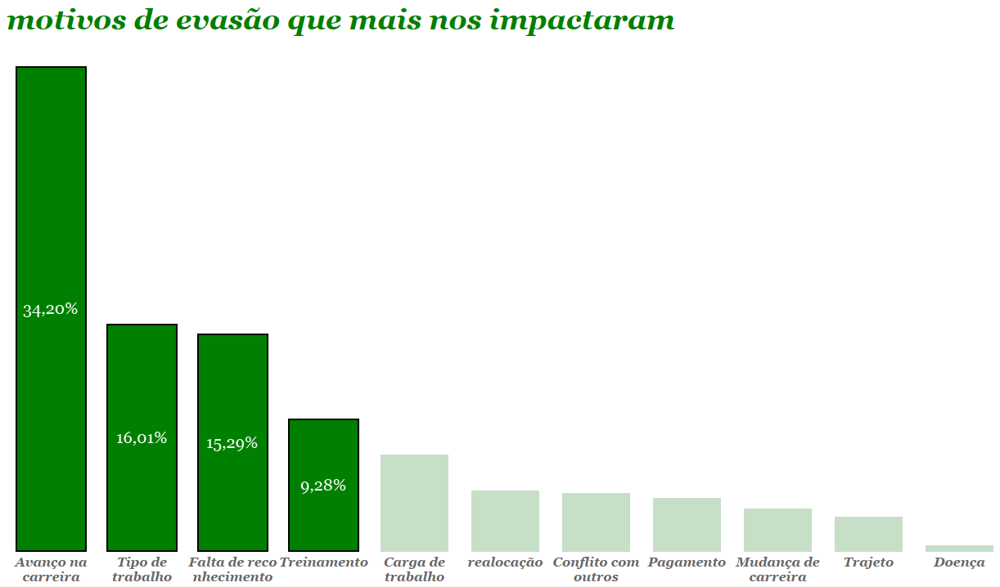

#  Analise da Saida de Funcionarios

Inicialmente, neste projeto, buscamos compreender os dados e como eles se comportam. Foi um desafio notar que não tínhamos apenas um conjunto de dados, mas sim três conjuntos distintos para análise. A partir deles, buscamos extrair insights valiosos. Para isso, procuramos entender o que cada conjunto de dados representava.

Tínhamos uma coluna chamada "capacidade de impacto," que funcionava como uma medida de peso para cada saída, criando uma distinção entre os diferentes conjuntos de dados. O segundo e o terceiro conjuntos eram interessantes, pois consistiam em duas pesquisas: uma realizada pelo nosso parceiro de RH e outra pela nossa equipe na saída dos colaboradores. Essas pesquisas tinham números diferentes de respostas, e os dados eram proporcionalmente distintos.

Após muitas discussões, chegamos à conclusão de que era necessário calcular uma média entre os percentuais de cada pesquisa, a fim de que o número maior de uma pesquisa não afetasse desproporcionalmente a segunda. Após esse cálculo, multiplicamos esse valor pela sua "capacidade de impacto" e novamente transformamos em porcentagem, tornando mais fácil para a nossa equipe compreender os principais motivos e o quanto eles afetavam a empresa.

Após isso, tornou-se muito mais fácil compreender os nossos tipos de demissões. Concentramos nossa atenção nos quatro principais, que representavam a grande maioria dos motivos, como pode ser observado claramente no gráfico acima. Por serem as principais causas, discorremos sobre os riscos que elas representam para nossa companhia. Além disso, propusemos alguns planos de ação que podem ajudar a empresa a lidar com a alta taxa de evasão, finalizando nossa analise dos dados.

## conclusão

Esse trabalho me mostrou que muitas vezes a melhor maneira de apresentar algo é simplesmente explicando. A análise de dados envolve muito mais o entendimento dos dados e saber como comunicá-los ao público do que apenas criar gráficos.

[link do dashboard com as princpais visualizações do trabalho](https://public.tableau.com/app/profile/david.lima5829/viz/analise_evaso/evaso_impacto?publish=yes)

### ferramentas
* tableau
* jupyter notbook

